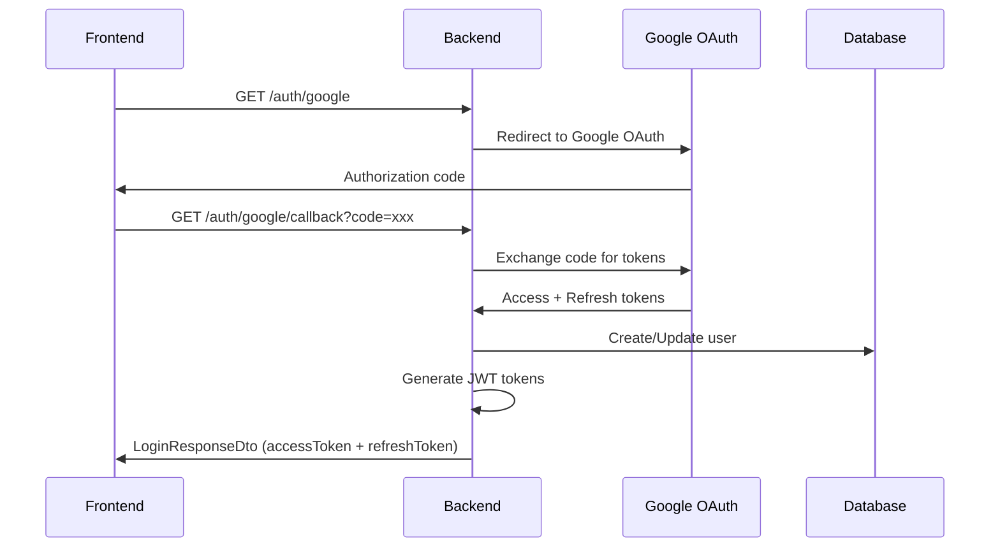
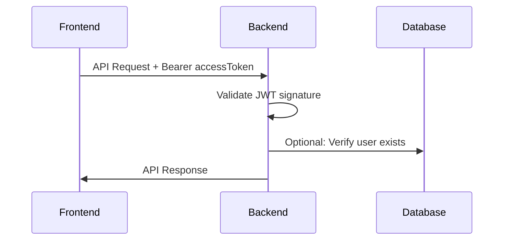
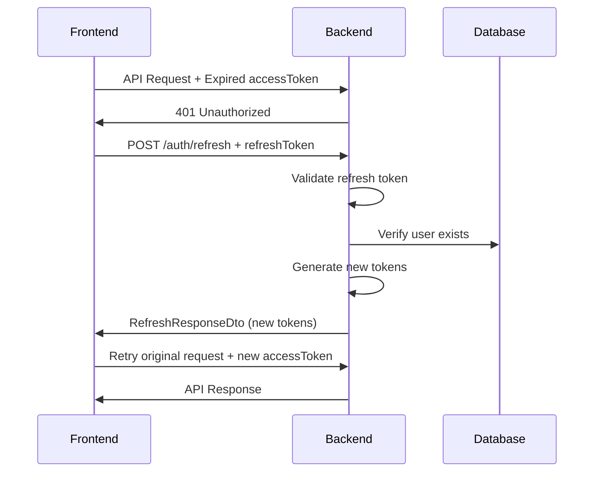

# Authentication Flow Documentation

## Overview

This document outlines the complete authentication flow for the Email Summarizer application, including Google OAuth integration, JWT token management, and refresh token handling.

## Table of Contents

1. [Authentication Architecture](#authentication-architecture)
2. [Token Strategy](#token-strategy)
3. [Authentication Flows](#authentication-flows)
4. [API Endpoints](#api-endpoints)
5. [Frontend Integration](#frontend-integration)
6. [Security Considerations](#security-considerations)
7. [Error Handling](#error-handling)
8. [Environment Configuration](#environment-configuration)

## Authentication Architecture

### Components

- **Google OAuth 2.0**: Primary authentication provider
- **JWT Tokens**: Stateless authentication mechanism
- **Passport.js**: Authentication middleware
- **NestJS Guards**: Route protection

### Token Types

1. **Access Token**: Short-lived (15 minutes) - Used for API calls
2. **Refresh Token**: Long-lived (7 days) - Used to renew access tokens

## Token Strategy

### Why Two Tokens?

```
🔐 Access Token (5m)     📱 Refresh Token (7d)
├─ Short lifespan        ├─ Longer lifespan
├─ Used for API calls    ├─ Used for renewal
├─ Stored in memory      ├─ Stored securely
└─ High security         └─ Balanced UX/Security
```

### Benefits

- **Security**: Limited exposure time for access tokens
- **User Experience**: Users don't need to re-authenticate every 15 minutes
- **Revocation**: Can invalidate refresh tokens for forced logout
- **Performance**: No database lookup for every API call

## Authentication Flows

### 1. Initial Google OAuth Login



### 2. API Request with Access Token



### 3. Token Refresh Flow



## API Endpoints

### Authentication Endpoints

#### `GET /auth/google`

Initiates Google OAuth flow

```typescript
Response: Redirect to Google OAuth
```

#### `GET /auth/google/callback`

Handles Google OAuth callback

```typescript
Query: { code: string, state?: string }
Response: LoginResponseDto
```

#### `POST /auth/refresh`

Refreshes access token using refresh token

```typescript
Body: RefreshTokenDto;
Response: RefreshResponseDto;
```

#### `POST /auth/logout`

Invalidates refresh token (optional endpoint for enhanced security)

```typescript
Body: {
  refreshToken: string;
}
Response: {
  message: 'Logged out successfully';
}
```

### Protected Endpoints

All other API endpoints require:

```
Authorization: Bearer <accessToken>
```

## Frontend Integration

### Token Storage

```typescript
// Recommended storage strategy
class TokenManager {
  private accessToken: string | null = null; // Memory only
  private refreshToken: string | null = null; // Secure storage

  // Store tokens after login
  setTokens(loginResponse: LoginResponseDto) {
    this.accessToken = loginResponse.accessToken;
    this.refreshToken = loginResponse.refreshToken;

    // Store refresh token in secure storage
    localStorage.setItem('refreshToken', loginResponse.refreshToken);
  }

  // Get access token for API calls
  getAccessToken(): string | null {
    return this.accessToken;
  }

  // Handle token refresh
  async refreshTokens(): Promise<boolean> {
    if (!this.refreshToken) return false;

    try {
      const response = await fetch('/auth/refresh', {
        method: 'POST',
        headers: { 'Content-Type': 'application/json' },
        body: JSON.stringify({ refreshToken: this.refreshToken }),
      });

      const data = await response.json();
      this.setTokens(data);
      return true;
    } catch (error) {
      this.clearTokens();
      return false;
    }
  }
}
```

### HTTP Interceptor Example

```typescript
// Auto-retry with token refresh
class ApiClient {
  async request(url: string, options: RequestInit = {}) {
    // Add access token to request
    const token = tokenManager.getAccessToken();
    if (token) {
      options.headers = {
        ...options.headers,
        Authorization: `Bearer ${token}`,
      };
    }

    let response = await fetch(url, options);

    // Handle token expiration
    if (response.status === 401) {
      const refreshSuccess = await tokenManager.refreshTokens();

      if (refreshSuccess) {
        // Retry with new token
        const newToken = tokenManager.getAccessToken();
        options.headers = {
          ...options.headers,
          Authorization: `Bearer ${newToken}`,
        };
        response = await fetch(url, options);
      } else {
        // Redirect to login
        window.location.href = '/login';
        return;
      }
    }

    return response;
  }
}
```

## Security Considerations

### Token Security

1. **Access Token**:
   - ✅ Store in memory only (not localStorage/sessionStorage)
   - ✅ Short expiration (15 minutes)
   - ✅ Include in Authorization header

2. **Refresh Token**:
   - ⚠️ Can be stored in secure HTTP-only cookies (preferred)
   - ⚠️ Or secure localStorage with proper CSP headers
   - ✅ Longer expiration (7 days)
   - ✅ Rotate on each refresh (for enhanced security)

### Additional Security Measures

```typescript
// JWT Configuration
{
  issuer: 'gystify-api',           // Prevents token misuse
  audience: 'gystify-frontend',    // Validates intended recipient
  algorithm: 'HS256',              // Secure signing algorithm
}
```

### Rate Limiting

```typescript
// Per IP rate limits
Login endpoints: 5 attempts/minute (production)
Refresh endpoint: 10 attempts/minute (production)
```

## Error Handling

### Common Error Scenarios

1. **Invalid/Expired Access Token** → `401 Unauthorized`
   - Frontend should attempt token refresh
   - If refresh fails, redirect to login

2. **Invalid/Expired Refresh Token** → `401 Unauthorized`
   - Clear stored tokens
   - Redirect to login page

3. **Google OAuth Failure** → `500 Internal Server Error`
   - Show user-friendly error message
   - Retry login option

### Error Response Format

```typescript
{
  statusCode: 401,
  message: "Invalid or expired token",
  error: "Unauthorized",
  timestamp: "2024-01-15T10:30:00Z"
}
```

## Environment Configuration

### Required Environment Variables

```bash
# Production (Required)
JWT_SECRET=your-super-secret-jwt-key-min-32-chars
JWT_REFRESH_SECRET=your-super-secret-refresh-key-min-32-chars
GOOGLE_CLIENT_ID=your-google-client-id
GOOGLE_CLIENT_SECRET=your-google-client-secret
GOOGLE_FE_CALLBACK_URL=https://yourdomain.com/auth/callback

# Optional
JWT_ACCESS_EXPIRES_IN=5m  # Default: 5m
JWT_REFRESH_EXPIRES_IN=7d  # Default: 7d
```

### Development Setup

```bash
# Development (Optional - has fallbacks)
JWT_SECRET=dev-secret-at-least-32-characters-long
GOOGLE_CLIENT_ID=dev-google-client-id
GOOGLE_CLIENT_SECRET=dev-google-client-secret
GOOGLE_FE_CALLBACK_URL=http://localhost:3000/auth/callback
```

## Testing the Flow

### Manual Testing Steps

1. **Login Flow**:

   ```bash
   # Visit login page
   curl -X GET http://localhost:3001/auth/google

   # Complete OAuth and check response
   # Should receive accessToken + refreshToken
   ```

2. **Protected Resource**:

   ```bash
   # Use access token
   curl -H "Authorization: Bearer <accessToken>" \
        http://localhost:3001/summaries
   ```

3. **Token Refresh**:
   ```bash
   # When access token expires
   curl -X POST http://localhost:3001/auth/refresh \
        -H "Content-Type: application/json" \
        -d '{"refreshToken": "<refreshToken>"}'
   ```

### Automated Testing

```typescript
// E2E Test Example
describe('Auth Flow', () => {
  it('should complete full auth cycle', async () => {
    // 1. Login and get tokens
    const loginResponse = await request(app)
      .get('/auth/google/callback?code=mock-code')
      .expect(200);

    // 2. Use access token
    await request(app)
      .get('/summaries')
      .set('Authorization', `Bearer ${loginResponse.body.accessToken}`)
      .expect(200);

    // 3. Refresh tokens
    const refreshResponse = await request(app)
      .post('/auth/refresh')
      .send({ refreshToken: loginResponse.body.refreshToken })
      .expect(200);

    // 4. Use new access token
    await request(app)
      .get('/summaries')
      .set('Authorization', `Bearer ${refreshResponse.body.accessToken}`)
      .expect(200);
  });
});
```

---

## Quick Reference

### Frontend Checklist

- [ ] Store access token in memory only
- [ ] Store refresh token securely
- [ ] Implement automatic token refresh
- [ ] Handle 401 errors gracefully
- [ ] Redirect to login when refresh fails

### Backend Checklist

- [ ] Validate JWT_SECRET in production
- [ ] Implement token refresh endpoint
- [ ] Use different secrets for access/refresh tokens
- [ ] Add rate limiting to auth endpoints
- [ ] Log authentication events for monitoring

### Security Checklist

- [ ] Short-lived access tokens (5m)
- [ ] Secure refresh token storage
- [ ] Proper CORS configuration
- [ ] HTTPS in production
- [ ] CSP headers configured
- [ ] Rate limiting enabled
